

<h1> 개나리 : 개와 나의 리듬</h1>

<h4> 스마트 워치 속 반려견과 함께 뛰는 러닝앱 서비스</h4>

# 1. 서비스 소개

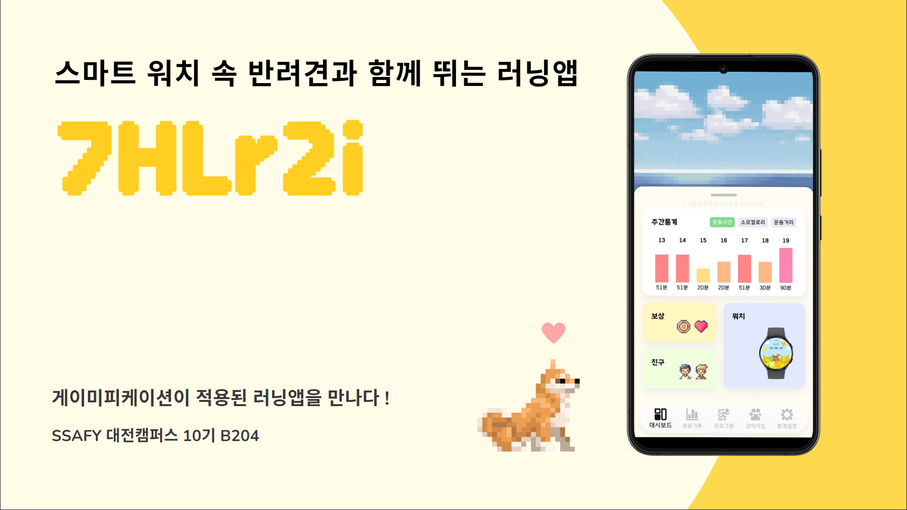

함께 성장하는 러닝 친구, 반려견과 함께 뛰는 러닝 앱!

사용자는 스마트 워치를 통해 걷기와 달리기 기록을 하고, 다양한 러닝 프로그램을 만들 수 있습니다.
운동을 통해 얻은 코인으로 반려견의 공간을 꾸밀 수 있으며, 상호작용을 통해 반려견의 애정도를 높일 수 있습니다.

## 소개 영상

[개나리 소개 영상](https://youtu.be/GV1APDHhtlc?si=JaQbl7lzEplCuBl4)

## 제작기간 및 참여 인원

프로젝트 기간 : 2024.4.15 ~ 2024.05.20 (6주)

참여 인원 : 6인

## 기획 배경

반려견을 기르는 사람들은 반려견과 함께 산책하면서 자연스럽게 운동을 하게 됩니다. 이 점에 착안하여 저희 “개나리”는 반려견이 없는 사람도 가상의 반려견과 함께 운동하며 성취감을 얻을 수 있는 앱을 개발하였습니다.

이 앱을 통해 사용자는 스마트 워치를 이용해 러닝 중 자신의 상태를 실시간으로 확인하고 러닝 기록을 저장할 수 있습니다. 또한, 러닝을 통해 획득한 코인으로 반려견의 집을 다양한 아이템으로 꾸밀 수 있습니다. 러닝을 하면 반려견의 애정도가 증가하여 티어가 올라가며, 이를 통해 사용자에게 지속적인 동기부여를 제공합니다.

# 2. 핵심 기능 및 기대효과

## 2.1 러닝 기능의 다양성

- 사용자가 직접 거리 목표, 시간 목표, 인터벌 달리기 프로그램을 만들어 워치에서 실행할 수 있습니다.
- 프로그램을 만들지 않아도 자유 달리기와 자유 걷기 기록을 남길 수 있습니다.
- **기대효과**: 개인 맞춤형 운동 프로그램을 통해 사용자의 운동 목표 달성을 돕고, 자유로운 기록 기능으로 운동 습관을 쉽게 유지할 수 있습니다.

## 2.2 반려견과의 상호작용

### 2.2.1 같이 뛰는 반려견

- 사용자가 워치를 통해 운동할 때, 스마트 워치 속 반려견도 함께 뛰며 운동 자극을 줍니다.
- 거리 목표와 시간 목표 프로그램으로 운동할 때는 사용자의 속도에 맞춰 강아지도 걷거나 뜁니다. 사용자가 걸으면 반려견도 걷고, 사용자가 뛰면 반려견도 뛰는 모습을 보입니다.
- 인터벌 달리기 프로그램으로 운동할 때는 반려견이 인터벌 구간마다 같이 뛰거나 걷습니다.
- **기대효과**: 사용자는 반려견과의 상호작용을 통해 운동에 대한 동기부여를 받고, 운동이 더 즐겁고 의미 있게 느껴집니다.

### 2.2.2 반려견 애정도

- 반려견의 집에서 반려견을 여러 번 터치하면 상호작용을 통해 애정도를 올릴 수 있습니다.
- 운동을 통해 미션을 완료하면 보상으로 애정도가 상승합니다. 애정도가 높아지면 반려견의 티어 또한 상승합니다.
- 일주일 동안 접속하지 않으면 반려견의 애정도가 매일 감소합니다. 사용자가 반려견의 애정도 관리를 위해 지속적으로 접속하고 운동할 수 있도록 합니다.
- **기대효과**: 반려견과의 정서적 유대감을 강화하며, 사용자의 지속적인 접속과 운동 참여를 유도합니다.

## 2.3 도전과제 보상

- 도전과제에는 미션과 업적이 있으며, 미션 보상으로 코인과 애정도를, 업적 보상으로 코인을 얻을 수 있습니다.
- 미션과 업적 시스템을 통해 사용자가 지속적으로 운동에 참여할 수 있습니다. 미션은 운동 기록에 따라 반복해서 달성할 수 있으며, 업적은 누적 기록으로 달성할 수 있습니다.
- **기대효과**: 다양한 도전과제를 통해 사용자에게 지속적인 운동 동기를 부여하며, 보상 시스템을 통해 성취감을 제공합니다.

## 2.4 꾸미기 상품 시스템

### 2.4.1 아이템 뽑기와 꾸미기

- 운동을 통해 얻은 코인으로 최대 6가지 테마 및 36가지의 아이템을 보유할 수 있습니다.
- 아이템은 등급에 따라 다른 확률로 뽑기가 가능합니다.
- 사용자는 꾸미기 아이템을 활용하여 반려견의 집을 자유롭게 꾸밀 수 있습니다.
- **기대효과**: 다양한 아이템을 통해 사용자에게 꾸미는 즐거움을 제공하며, 운동의 결과로 얻는 보상의 만족도를 높입니다. 아이템을 다양하게 조합하여 공간을 꾸미는 경험을 통해 사용자의 창의성을 발휘할 기회를 제공합니다.

### 2.4.2 반려견 입양

- 운동을 통해 얻은 코인으로 10종류의 반려견을 입양할 수 있습니다.
- 현재 파트너 반려견이 받지 않은 보상을 모두 수령해야 새로운 파트너 반려견으로 교체할 수 있습니다.
- **기대효과**: 다양한 반려견을 입양할 수 있어 사용자에게 새로운 목표와 즐거움을 제공합니다.

### 2.4.3 친구 집

- 친구의 집에 방문하여 친구가 어떻게 반려견의 집을 꾸몄는지 확인하고 경쟁할 수 있습니다.
- **기대효과**: 친구와의 소셜 인터랙션을 통해 경쟁심을 유발하며, 공간 꾸미기를 통해 더욱 재미있고 다채로운 상호작용을 즐길 수 있습니다.

# 3. 기술 특장점

## 3.1 워치 서비스

- 워치 내부의 GPS와 구글 locationservice를 이용하여 사용자위치의 좌표정보를 1초마다 저장
  이전 좌표값과 비교하여 사용자의 운동 총 이동거리, 현재 속력을 구하고 화면에 표시합니다.
- 워치 내부의 센서를 이용하여 운동중일때의 사용자의 심박수를 1초마다 업데이트하고
  운동이 끝났을때 평균값을 계산해 결과화면에 보여줍니다.
- 시간 서비스를 만들어 순수한 운동데이터를 관리하고자 만들었습니다
  일시정지일 때에는 화면 업데이트가 되지않고 데이터또한 받고 무시되게 처리하였습니다.

## 3.2 MSA & CircuitBreaker Pattern

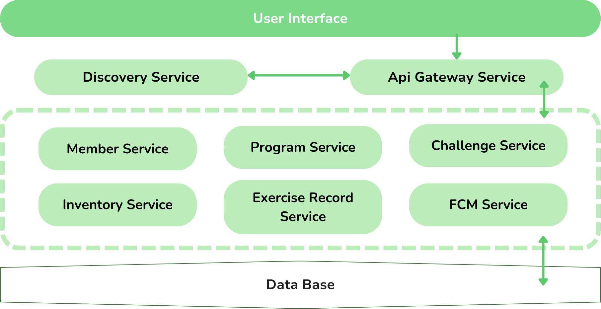
- MSA 방식을 도입함으로써 저희는 전체 시스템의 유연성과 확장성을 극대화하였고, 안정적이고 지속 가능한 서비스를 제공합니다.
- 각 서비스 별로 업데이트를 할 때나 기능을 추가할 때에도 전체 서비스 중단 없이 진행할 수 있었으며, 장애 발생 시에도 해당 서비스만 수정하고 재배포할 수 있었습니다.
- Circuit Breaker Pattern을 사용하여 사용자가 앱을 사용하는 동안 특정 서비스에서 장애가 발생하더라도 다른 서비스까지 영향을 미치지 않게 하였습니다.

[MSA & CircuitBreaker Pattern 적용](https://notch-asparagus-0e8.notion.site/MSA-CircuitBreaker-Pattern-c08a8cf3d25c42e087d4f22fe0f3d64f?pvs=4)

# 4. 상세기능

<h2>1) 회원가입 및 로그인</h2>

       
<h3>1-1 회원가입</h3>

- 총 4개의 단계로 회원가입을 진행됩니다.

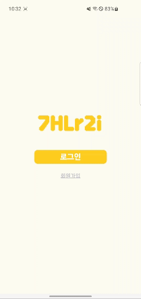{: width="350px"}

- 아이디와 비밀번호 설정 - 아이디는 숫자, 영어대소문자를 입력할 수 있습니다. - 비밀번호는 영어대소문자, 숫자, 특수문자(!@#$%^) 를 입력할 수 있습니다.

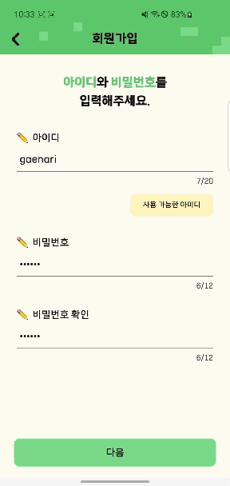{: width="350px"}

- 닉네임과 생년월일, 성별 설정 - 닉네임은 한글, 영어대소문자를 입력할 수 있습니다. - 생년월일은 년,월,일을 드래그하여 설정할 수 있습니다. - 성별은 남자, 여자, 선택안함 중에 선택할 수 있습니다.

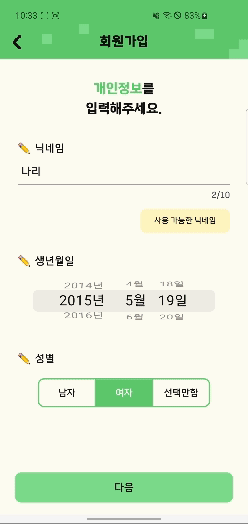{: width="350px"}

- 키와 몸무게 설정
  - 키와 몸무게의 수치를 각각 설정 할 수 있습니다.
- 함께할 파트너강아지 설정
  - 10가지의 강아지 종류중 하나를 선택하고 강아지의 이름을 고릅니다.
- 회원가입이 끝난 후 로그인페이지로 이동할 수 있습니다.

<h3>1-2 로그인</h3>

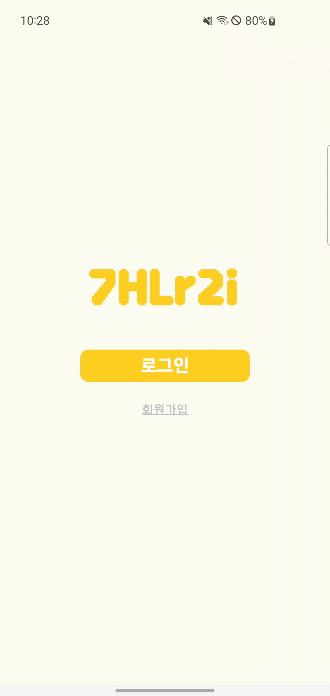{: width="350px"}

- 아이디와 비밀번호를 작성후 로그인을 진행합니다.

<h2>2) 대시보드</h2>

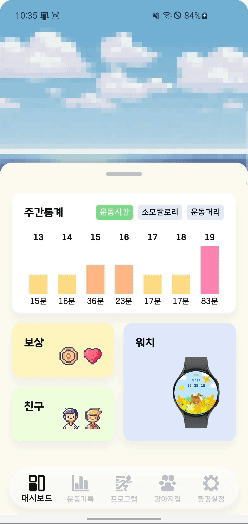{: width="350px"}

- 주간기록을 거리,칼로리,시간별로 통계를 확인할 수 있습니다.
- 대시보드에서는 중요하거나 자주 이용하는 것을 기준으로 배치했습니다.
  - 운동에 대한 보상을 받을 수 있는 보상 공간
  - 친구의 집에 놀러갈 수 있는 친구 공간
  - 워치와 빠르게 연동할 수 있는 워치 공간.
- 패널을 내리면 회원가입 때 고른 나의 강아지가 터치할때마다 이동한 후 행동과 말풍선의 내용을 바꿉니다.

<h3>2-1 보상</h3>

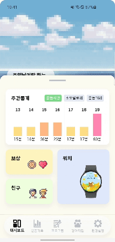{: width="350px"}

- 운동한 거리와 시간이 누적되어 목표를 이루면 보상을 받을 수 있는 업적 탭
  - 업적항목마다 아래에 어느정도 완료했는지 프로그래스바가 존재하며 업적달성시 보상을 받고, 보상을 받은 업적은 가장 아래로 위치하게 됩니다.
- 운동을 완료할 때 마다 목표된 거리와 시간만큼 보상을 받을 수 있는 미션 탭
  - 보상받기를 누르면 코인과 애정도를 얻을 수 있고, 그동안 미션을 몇 번 완료했는지 확인할 수 있습니다.

<h3>2-2 친구</h3>

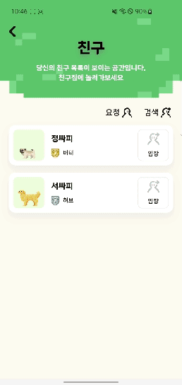{: width="350px"}

- 현재 나와의 친구 목록과 친구요청버튼, 친구추가버튼을 확인할 수 있습니다.
- 친구집에 입장을 하게 되면 친구집의 아이템들과 나의 강아지와 친구의 강아지를 확안할 수 있습니다.
  - 아래에 친구강아지의 티어,이름과 친구의 아이템티어들을 확인할 수 있습니다.

<h4>2-2-1 친구 검색 및 요청</h4>

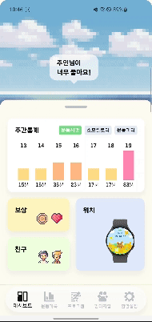{: width="350px"}

- 친구 검색은 닉네임을 기준으로 하고 공백, 특수문자는 검색이 되지 않도록 처리했습니다.
- 친구를 검색하면 오른편에 검색된 사람과 나의 관계를 확인할 수 있습니다.
  - 나와 친구인 경우 - 친구
  - 친구 요청을 보낸경우 - 요청중
  - 친구 요청을 보내지않은 경우 - 친구추가
- 친구 추가를 클릭하면 친구에게 요청을 보낼 것인지 한번 더 확인하고 확인버튼을 클릭 후 요청을 보냈다는 토스트가 뜨게됩니다.

- 친구 요청 탭에서 받은 요청과 보낸 요청을 확인 할 수 있습니다.
- 받은 요청에서 수락과 거절을 선택할 수 있습니다.

<h3>2-3 워치</h3>

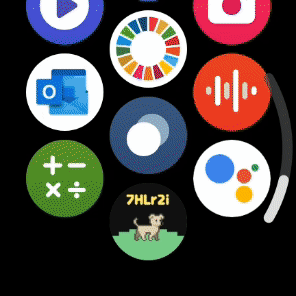

- 워치와 연동 할 수 있도록 4자리 숫자를 받을 수 있습니다.
- 입력제한시간 3분을 두고, 번호를 다시 받을 수 있는 버튼이 존재합니다.

<h2>3) 프로그램</h2>

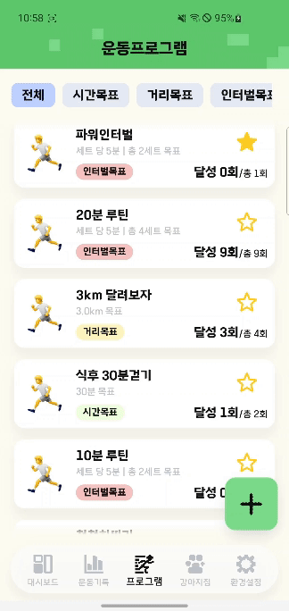{: width="350px"}

- 프로그램탭에서 현재 나의 프로그램 목록을 확인할 수 있습니다.
- 프로그램은 시간목표, 거리목표, 인터벌로 나눠져있고 상단의 탭을 통해 필터링을 할 수 있습니다.
- 프로그램 항목을 오른쪽으로 스와이프하여 즐겨찾기를 하고, 왼쪽으로 스와이프하여 삭제 할 수 있습니다.
  - 즐겨찾기한 프로그램은 워치에서 바로 실행 할 수 있습니다.
- 오른쪽하단에 프로그램 추가버튼이 존재하고 클릭했을때 어떤 프로그램을 추가할 지 선택할 수 있습니다.

<h3>3-1 프로그램 추가</h3>

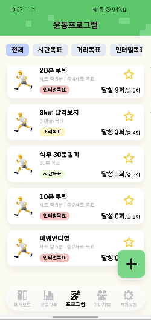{: width="350px"}

- 시간목표인 경우 프로그램의 이름과 목표시간을 설정할 수 있습니다.
- 거리목표인 경우 프로그램의 이름과 목표거리를 설정할 수 있습니다.
- 인터벌인 경우 프로그램의 이름과 인터벌의 구간과, 구간의 반복횟수를 설정할 수 있습니다.
  - 인터벌의 구간은 속력과 시간, 달릴지말지를 설정 할 수 있습니다.

<h3>3-2 프로그램 상세</h3>

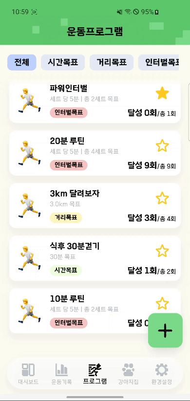{: width="350px"}

- 프로그램을 클릭하면 프로그램의 정보들을 확인할 수 있습니다.
  - 프로그램에서의 거리기록, 소모한칼로리기록, 시간기록의 합계통계를 확인할 수 있습니다.
  - 프로그램을 몇번 달성했는지 확인할 수 있습니다.
  - 프로그램을 진행한 운동기록들을 모아볼 수 있습니다.

<h3>3-3 프로그램 실행 - 워치</h3>

|                    걷기                    |                       달리기                       |                        일시정지                        |
|:----------------------------------------:| :------------------------------------------------: | :----------------------------------------------------: |
| {: width="250px"} | 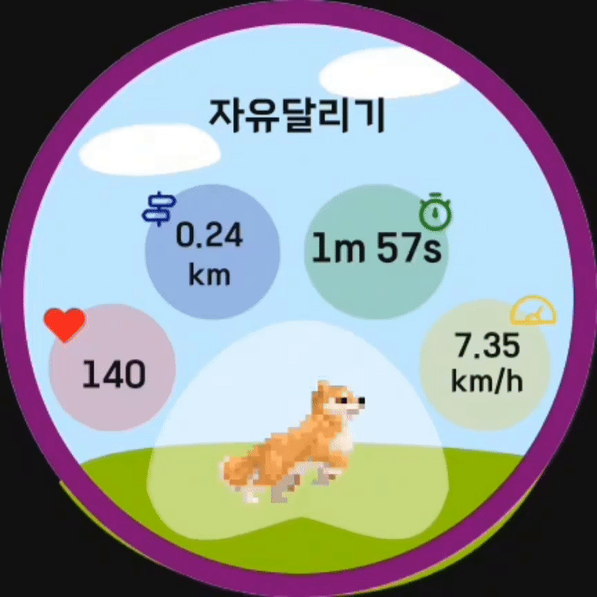{: width="250px"} | 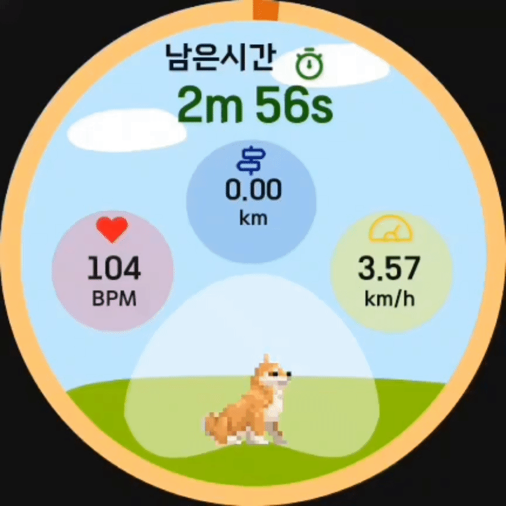{: width="250px"} |

|                      인터벌걷기                      |                    인터벌달리기                    |
| :--------------------------------------------------: | :------------------------------------------------: |
| 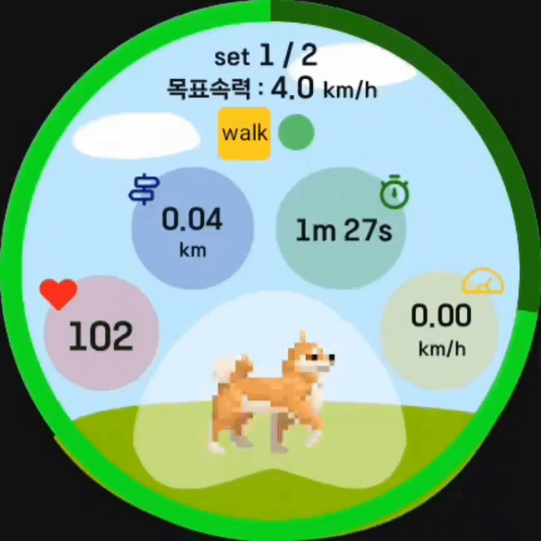{: width="250px"} | {: width="250px"} |

- 워치 화면에서 즐겨찾기로 등록된 운동을 리스트 형식으로 확인랍니다
  - 프로그램을 클릭시 5초 카운트다운이 시작되고 해당 운동이 시작되게됩니다.
  - 자유달리기, 자유걷기, 거리목표, 시간목표, 인터벌로 구성되어있는 프로그램들은
    프로그램마다의 고유 색상이 존재하고 보여지는 UI가 다르게 되어있습니다.
  - 운동중 화면에서 중앙에 대표로 설정한 강아지가 함께 운동을 하게됩니다.
    인터벌을 제외한 운동에서 강아지는 사용자의 속도에 따라
    6km/h를 기준으로 걷거나 뛰는 모션을 취합니다
  - 일시정지와 종료버튼이 존재하며 실수로 누르는 것을 방지하기위해
    1초, 2초간 꾹 눌러서 실행됩니다.
  - 운동이 일시정지일시에 강아지도 같이 앉아서 휴식하는 모션을 취합니다.

<h3>3-4 프로그램 종료 - 워치<h3/>
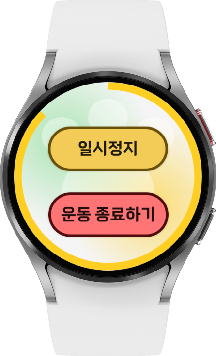 | 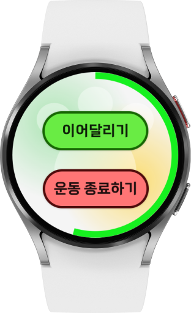 |  |

- 사용자가 설정한 목표가 달성되면 운동이 자동으로 종료되고 결과페이지로 넘어갑니다.
- 사용자가 운동종료 버튼을 클릭하여 운동을 종료시키면 결과페이지로 넘어갑니다.

### 3-5 프로그램 결과 - 워치
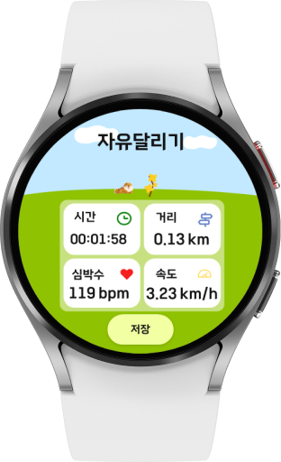{: width="150px"}

- 사용자가 진행한 운동의 수치값을 화면에 나타냅니다.
- 저장버튼을 통해 운동 기록을 저장 할 수 있습니다.

<h2>4) 기록</h2>

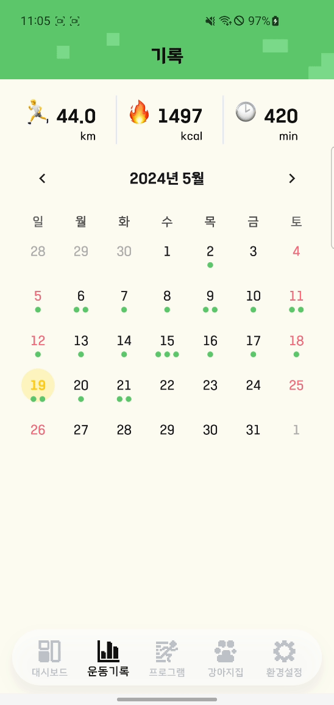{: width="350px"}

- 기록탭에서 월간 운동의 거리기록, 소모한칼로리기록, 시간기록의 합계통계를 확인 할 수 있습니다.
- 가운데에 달력이 존재하고 운동을 한 날짜에 초록색 점이 표시됩니다. (최대3개)
  - 특정 날짜를 선택하면 해당날짜에 운동한 운동기록들을 확인 할 수 있습니다.
  - 운동기록은 거리, 칼로리, 시간기록을 간단히 확인할 수 있고, 클릭했을 때 기록상세로 들어갈 수 있습니다.

<h3>4-1 기록 상세</h3>

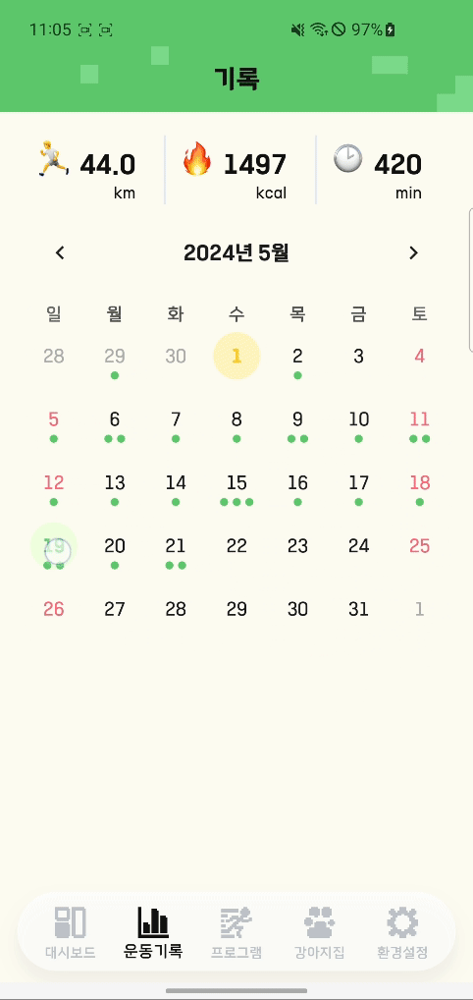{: width="350px"}

- 상단에서 어떤 운동을 진행했는지 확인 하고, 프로그램운동의 기록인 경우 달성, 미달성 여부를 확인 할 수 있습니다.
- 1분단위의 페이스와, 심박수를 체크할 수 있습니다.
- 인터벌인 경우 인터벌 구간의 속도와 실제 속도를 비교할 수 있습니다.
- 아래에 기록에서 생긴 운동보상을 확인하고 보상받기를 클릭하여 획득할 수 있습니다.

<h2>5) 강아지집</h2>

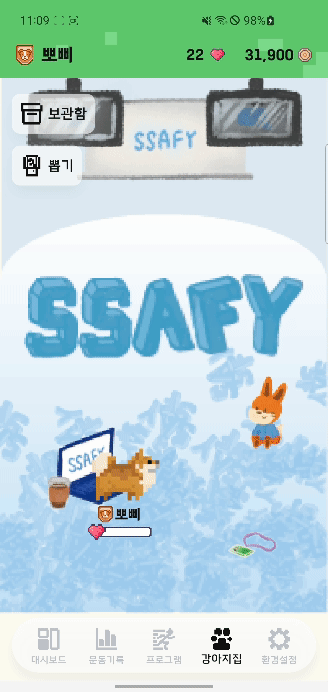{: width="350px"}

- 현재 나의 파트너강아지의 티어와 이름과, 애정도수치, 코인의 양을 확인할 수 있습니다.
- 왼쪽 상단에 나의 아이템목록과 새로운 강아지를 입양할 수 있는 보관함 버튼과 새로운 아이템을 뽑을 수 있는 뽑기 버튼이 존재합니다.
- 가운데에 내가 설정한 아이템들과 나의 파트너강아지를 확인 할 수 있습니다.
  - 파트너강아지를 터치하면 강아지하단에 위치한 애정도 게이지가 차고, 게이지가 다 차면 애정도가 1 상승합니다.
  - 애정도가 100이 되면 다음 등급으로 올랐다는 팝업창이 등장합니다.

<h3>5-1 뽑기</h3>

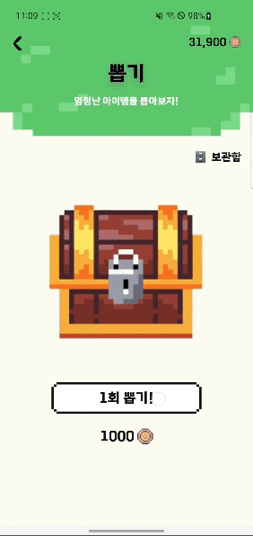{: width="350px"}

- 뽑기 버튼을 클릭하면 뽑기버튼이 사라지고 상자가 흔들리면서 뽑은 아이템을 확인 할 수 있는 팝업이 등장합니다.
- 팝업에서는 아이템의 등급별로 배경의 색이 다르고, 중복된 아이템을 뽑은 경우 회색 배경으로 등장합니다.
- 팝업에서 다시뽑기를 진행한 경우 팝업이 닫히고 다시 상자가 흔들리고 난 후 팝업이 나타납니다.

<h3>5-2 보관함- 아이템탭</h3>

{: width="350px"}

- 상단에 아이템탭과 강아지탭을 확인할 수 있습니다
- 아이템탭에서 해당아이템들을 세트로 나눠져 있고 하나의 세트를 클릭하면 해당 세트에서 보유중인 항목, 착용중인 항목, 아직 보유하지 못한 항목을 확인할 수 있습니다.
- 보유중인 항목은 클릭하여 착용할 수 있습니다.

<h4>5-2-1 강아지탭</h4>

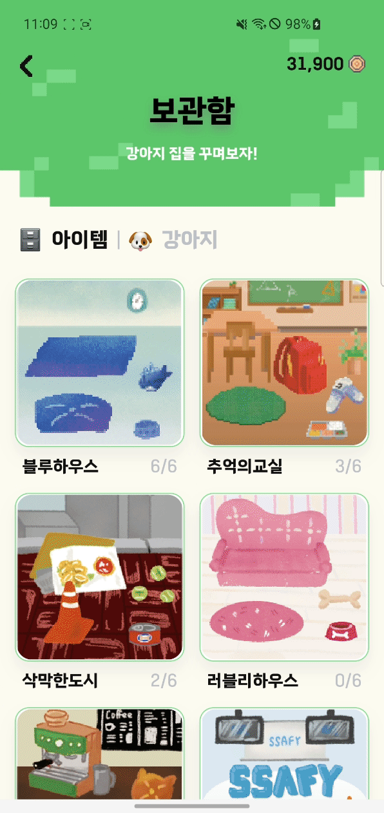{: width="350px"}

- 강아지탭에서 내가 보유한 강아지와, 파트너강아지를 확인하고 보유하지 못한 강아지를 20000코인으로 입양할 수 있습니다.
- 코인이 충분하지만 보상을 받지 않은 경우 보상 스크린으로 이동할 수 있습니다.
- 입양을 할 때 강아지의 이름을 입력하고 입양을 할 수 있습니다.

<h2>6) 설정</h2>

<h3>6-1 닉네임변경</h3>

{: width="350px"}
- 닉네임변경 버튼을 클릭해서 닉네임의 중복확인 후 닉네임을 변경할 수 있습니다.

<h3>6-2 비밀번호변경</h3>

{: width="350px"}

- 비밀번호변경 버튼을 클릭해서 현재비밀번호를 확인한 후 새로운 비밀번호를 설정할 수 있습니다.

<h3>6-3 신체정보 변경</h3>

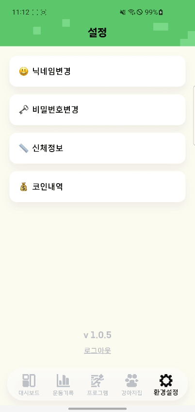{: width="350px"}

- 신체정보변경 버튼을 클릭해서 신체정보를 변경할 수 있습니다.

<h3>6-4 코인내역</h3>

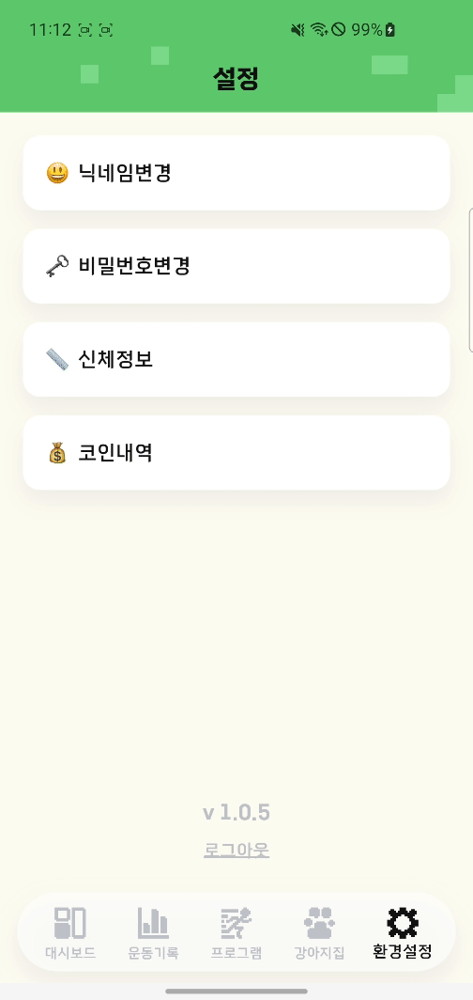{: width="350px"}

- 코인내역 버튼을 클릭해서 월별로 코인의 획득과 사용내역을 확인 할 수 있습니다.

# 5. 기술 스택

<h1>✨개발환경✨</h1>
 

<h1>✨Front-end Stack✨</h1>
  

<h1>✨Back-end & DataBase Stack✨</h1>
 

<h1>✨Infra Stack✨</h1>

<h1>✨CI / CD✨</h1>

<h1>✨wear OS✨</h1>

<h1>✨협업툴✨</h1>

<h1>✨디자인✨</h1>
 

# 6. 팀원 소개

|                     팀장 & Infra                     |                       Backend                        |                       Backend                        |
| :--------------------------------------------------: | :--------------------------------------------------: | :--------------------------------------------------: |
| 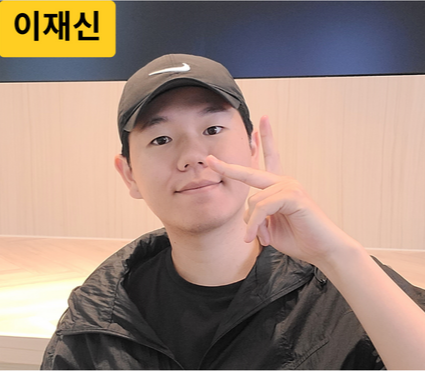 | 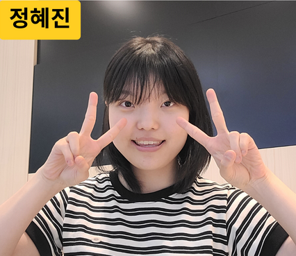 | 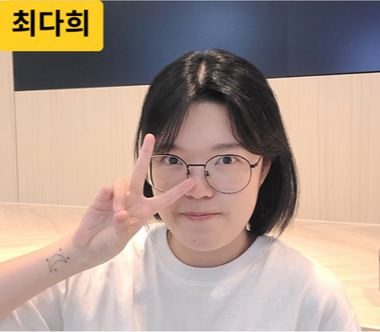 |
|        [이재신](https://github.com/jaesin463)        |        [정혜진](https://github.com/pado7sea)         |        [최다희](https://github.com/HeeHiHee)         |

|                        Watch                         |                       Frontend                       |                       Frontend                       |
| :--------------------------------------------------: | :--------------------------------------------------: | :--------------------------------------------------: |
| 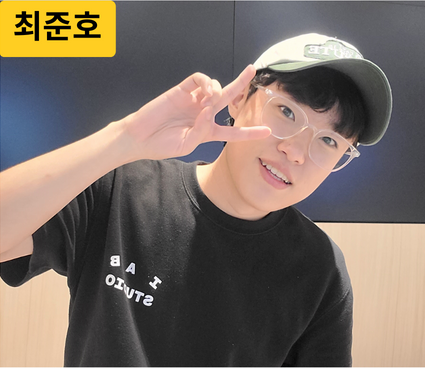 |  | 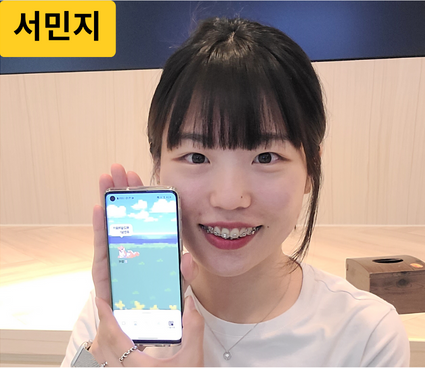 |
|        [최준호](https://github.com/cwnsgh98)         |         [서만기](https://github.com/seom98)          |        [서민지](https://github.com/sxominxi)         |

# 7. 포팅 메뉴얼

### [포팅메뉴얼](https://notch-asparagus-0e8.notion.site/8fe43c9663464f5fb279a261a0350291?pvs=4)

# 8. 기타 산출물 링크

### [기능 명세서](https://notch-asparagus-0e8.notion.site/a2f9ed166f7442c0817f363091abc1e2?pvs=4)

### [와이어 프레임](https://www.figma.com/design/B6ojIaHY3HZnz9TlNDjWbA/B204?node-id=206-3735)

### [ERD](https://www.erdcloud.com/d/mHk5qaEABxBTMepF3)

### [API 명세서](https://notch-asparagus-0e8.notion.site/API-d6a452a253e1458bb600fa9aebc17474?pvs=4)

### [발표 PDF](docs/개나리 발표 PDF.pdf)
